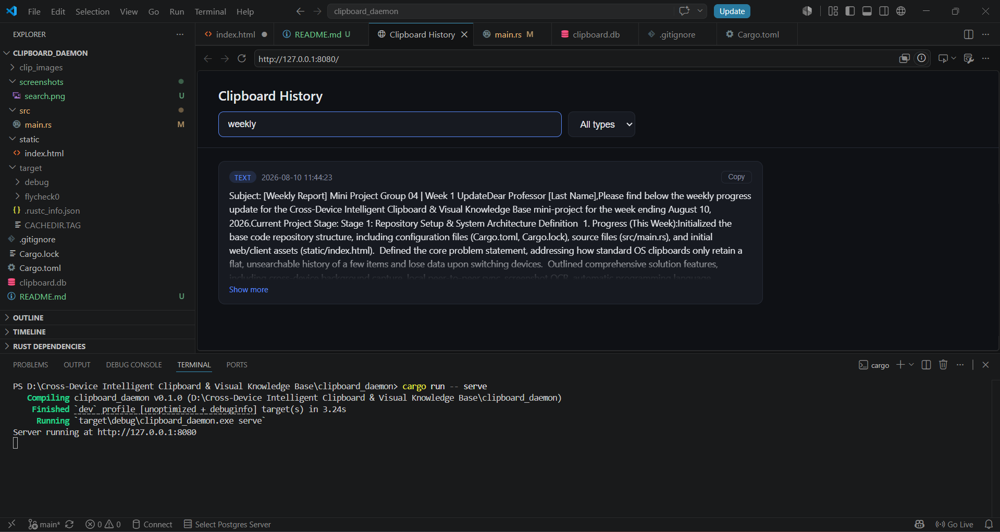
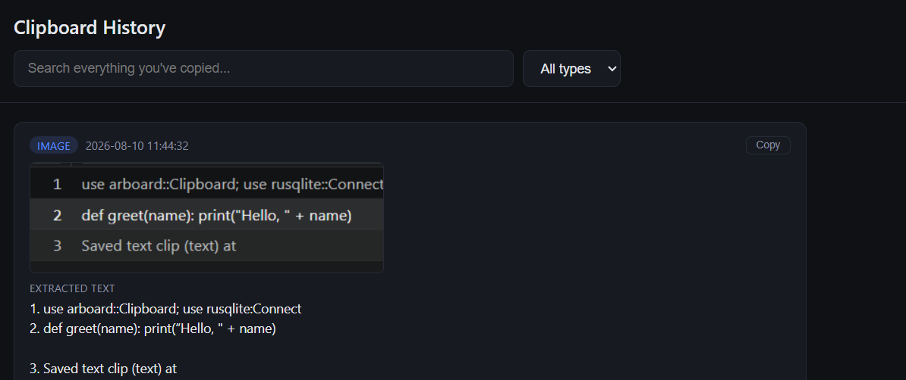

# Cross-Device Intelligent Clipboard & Visual Knowledge Base

A background clipboard tool that captures everything you copy — text, code, and
screenshots — stores it searchably, and makes it recoverable long after the
standard OS clipboard would have lost it.

## Problem

Standard OS clipboards only retain the last item or two, in a flat,
unsearchable list. Once a device is switched or time passes, that information
is effectively lost. Screenshots and images are especially hard to recover,
since there's no way to search their contents.

## What this project does

A background daemon that:

- Captures everything copied — plain text and screenshots/images
- Deduplicates using content hashing (SHA-256), so re-copying the same thing
  doesn't create redundant entries
- Runs OCR (Tesseract) on screenshots, so image content becomes searchable text
- Automatically detects the programming language of copied code snippets
  using pattern-based heuristics
- Stores everything locally in SQLite — no cloud dependency
- Provides a searchable local web UI (and a CLI search mode) to browse and
  find anything you've ever copied

## Status: implemented vs. planned

| Feature                                   | Status               |
|--------------------------------------------|----------------------|
| Text clipboard capture                     | ✅ Implemented        |
| Screenshot/image capture                   | ✅ Implemented        |
| Content-hash deduplication                 | ✅ Implemented        |
| OCR on screenshots (Tesseract)             | ✅ Implemented        |
| Programming language detection             | ✅ Implemented (heuristic-based) |
| Local SQLite storage                       | ✅ Implemented        |
| Search (substring, across text + OCR text) | ✅ Implemented        |
| Local web UI (search, filter, browse)      | ✅ Implemented        |
| Copy-back-to-clipboard from UI             | ✅ Implemented        |
| Cross-device LAN sync (iroh/libp2p)        | 🔲 Planned, not yet implemented |
| Natural-language / semantic search         | 🔲 Planned — would need sqlite-vec + embeddings |
| Auto-grouped "threads" of related clips    | 🔲 Future work         |
| Diagram/whiteboard structure extraction    | 🔲 Future work         |
| Privacy-tiered sync (secret/personal/ordinary) | 🔲 Future work     |
| Usage-driven ranking                       | 🔲 Future work         |
| One-line digests of long clips             | 🔲 Future work         |
| Flutter cross-platform client              | 🔲 Future work — current build is Windows-only via a local web UI |

The scope was deliberately narrowed from the original proposal to a fully
working core pipeline (capture → dedupe → OCR → detect → store → search →
browse) rather than partially implementing every stretch feature.

## Tech stack

- **Daemon**: Rust, using `arboard` for cross-platform clipboard access
- **OCR**: Tesseract (via `rusty-tesseract`)
- **Storage**: SQLite (via `rusqlite`, bundled — no separate SQLite install needed)
- **Hashing/dedup**: SHA-256 (via `sha2`)
- **Web server**: `tiny_http`, serving a JSON API + a static HTML/JS frontend
- **Frontend**: vanilla HTML/CSS/JS (no framework) — kept intentionally simple

## Architecture

```
Clipboard (OS) --> Rust daemon (watcher loop)
                      |
                      |-- text?  --> language detection --> save to SQLite
                      |-- image? --> save PNG --> OCR (Tesseract) --> save to SQLite
                      |
SQLite (clipboard.db) <-- read by --> Web server (tiny_http)
                                          |
                                          |-- /api/clips   (JSON)
                                          |-- /api/search  (JSON)
                                          |-- /clip_images/*.png
                                          |-- /  (HTML UI)
```

## Database schema

```sql
CREATE TABLE clips (
    id           INTEGER PRIMARY KEY AUTOINCREMENT,
    content      TEXT NOT NULL,   -- clip text, or image file path
    content_type TEXT NOT NULL,   -- "text" or "image"
    device_id    TEXT NOT NULL,   -- reserved for multi-device sync
    created_at   TEXT NOT NULL,
    ocr_text     TEXT,            -- extracted text for image clips
    content_hash TEXT NOT NULL,   -- SHA-256, used for deduplication
    language     TEXT             -- detected programming language, if any
);
```

## Running it

Requires: Rust (via rustup), Tesseract OCR installed and on PATH.

```bash
# Watch the clipboard and save everything copied
cargo run

# Search from the command line
cargo run -- search "some query"

# Start the web UI at http://127.0.0.1:8080
cargo run -- serve
```

## Screenshots

_(Add 2-3 screenshots here: the web UI showing a list of clips, a search
result, and an image clip with its extracted OCR text. Place image files in a
`screenshots/` folder in the repo and reference them like:)_

```markdown



```

## Future work

The largest remaining piece from the original proposal is **cross-device LAN
sync** — the current build stores everything locally on a single machine.
The database schema already includes a `device_id` column in anticipation of
this, but peer discovery and sync logic (planned via `iroh` or `libp2p`) was
out of scope for this stage. Semantic/natural-language search, auto-grouped
clip "threads," diagram/whiteboard structure extraction, privacy-tiered sync,
usage-driven ranking, one-line digests, and the Flutter client are similarly
scoped as future work rather than attempted in this build, in favor of a
fully working, demoable core pipeline.

## Author

Piyush Dhanpal Patil